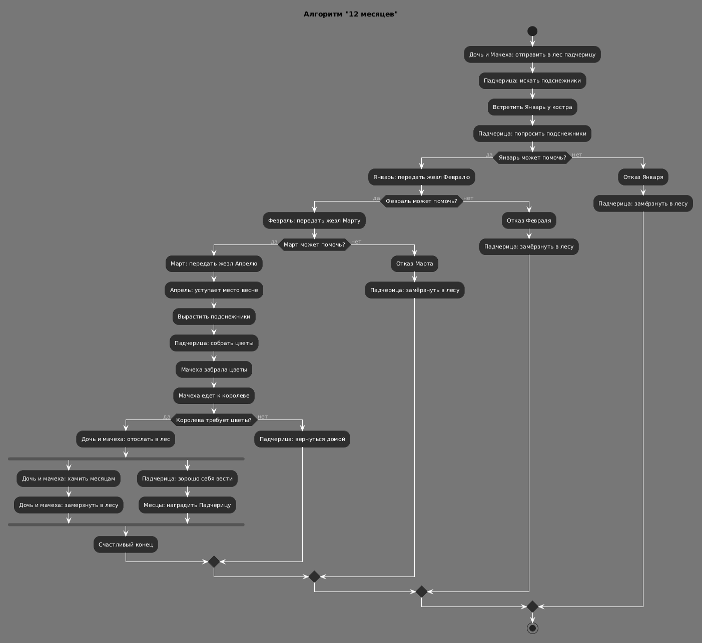

# Activity Diagram: Алгоритм системы "12 месяцев"

## Обзор

Эта диаграмма активности показывает алгоритм работы системы "12 месяцев" с учётом всех сценариев сказки.

## Описание потока

### Шаг 1: Отправка в лес
- Дочь и Мачеха отправляют Падчерицу в лес за подснежниками

### Шаг 2: Поиск и встреча с Январём
- Падчерица ищет подснежники
- Встречает Январь у костра
- Просит подснежники

### Шаг 3: Цепочка передачи жезла
- Январь может помочь? → **Да**
  - Передаёт жезл Февралю
  - Февраль передаёт Марту
  - Март передаёт Апрелю
  - Апрель уступает место весне
  - Вырастают подснежники
- Если любой из месяцев отказывает → Падчерица замерзает

### Шаг 4: Сбор и передача цветов
- Падчерица собирает цветы
- Мачеха забирает цветы
- Мачеха едет к Королеве

### Шаг 5: Требование Королевы
- Королева требует ещё цветы? → **Да**
  - Дочь и Мачеху отправляют в лес
  - Они хамят месяцам
  - Замерзают в лесу
  - Падчерица ведёт себя хорошо
  - Месяцы награждают Падчерицу
  - **Счастливый конец**
- Если Королева не требует → Падчерица возвращается домой

## Точки принятия решений

| Условие | Результат при "Да" | Результат при "Нет" |
|-----------|-------------------|---------------------|
| Январь может помочь? | Передача жезла Февралю | Падчерица замерзает |
| Февраль может помочь? | Передача жезла Марту | Падчерица замерзает |
| Март может помочь? | Передача жезла Апрелю | Падчерица замерзает |
| Королева требует цветы? | Отправка в лес (наказание) | Падчерица возвращается домой |

## Диаграмма



```plantuml
@startuml
!theme reddress-darkred
skinparam conditionStyle inside
title Алгоритм "12 месяцев"

start
:Дочь и Мачеха: отправить в лес падчерицу;
:Падчерица: искать подснежники;

:Встретить Январь у костра;
:Падчерица: попросить подснежники;

if (Январь может помочь?) then (да)
    :Январь: передать жезл Февралю;
    if (Февраль может помочь?) then (да)
        :Февраль: передать жезл Марту;
        if (Март может помочь?) then (да)
            :Март: передать жезл Апрелю;
            :Апрель: уступает место весне;
            :Вырастить подснежники;
            :Падчерица: собрать цветы;
            :Мачеха забрала цветы;
            :Мачеха едет к королеве;
            
            if (Королева требует цветы?) then (да)
                :Дочь и мачеха: отослать в лес;
                fork
                    :Дочь и мачеха: хамить месяцам;
                    :Дочь и мачеха: замерзнуть в лесу;
                fork again
                    :Падчерица: хорошо себя вести;
                    :Месяцы: наградить Падчерицу;
                end fork
                :Счастливый конец;
            else (нет)
                :Падчерица: вернуться домой;
            endif
        else (нет)
            :Отказ Марта;
            :Падчерица: замёрзнуть в лесу;
        endif
    else (нет)
        :Отказ Февраля;
        :Падчерица: замёрзнуть в лесу;
    endif
else (нет)
    :Отказ Января;
    :Падчерица: замёрзнуть в лесу;
endif

stop
@enduml
