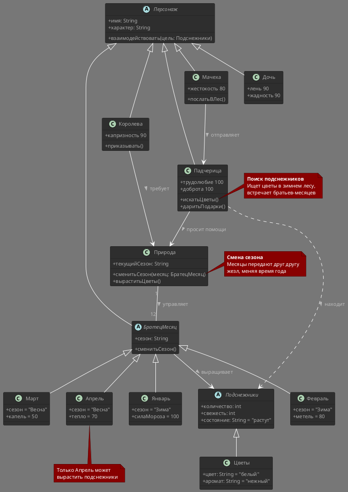

# Class Diagram: 12 месяцев

## Обзор

Эта диаграмма классов показывает объектно-ориентированную структуру системы сказки "12 месяцев".

## Иерархия классов

### Иерархия существ

| Class | Type | Attributes | Methods |
|-------|------|------------|---------|
| Персонаж | Abstract | + имя: String, + характер: String | + взаимодействовать(цель: Подснежники) |
| БратецМесяц | Abstract | extends Персонаж, + сезон: String | + сменитьСезон() |
| Январь | Concrete | + сезон = "Зима", + силаМороза = 100 | extends БратецМесяц |
| Февраль | Concrete | + сезон = "Зима", + метель = 80 | extends БратецМесяц |
| Март | Concrete | + сезон = "Весна", + капель = 50 | extends БратецМесяц |
| Апрель | Concrete | + сезон = "Весна", + тепло = 70 | extends БратецМесяц |
| Падчерица | Concrete | + трудолюбие = 100, + доброта = 100 | + искатьЦветы(), + даритьПодарки() |
| Королева | Concrete | + капризность = 90 | + приказывать() |
| Мачеха | Concrete | + жестокость = 80 | + послатьВЛес() |
| Дочь | Concrete | + лень = 90, + жадность = 90 | extends Персонаж |

### Иерархия ресурсов

| Class | Type | Attributes | Methods |
|-------|------|------------|---------|
| Подснежники | Abstract | + количество: int, + свежесть: int, + состояние: String = "растут" | - |
| Цветы | Concrete | + цвет: String = "белый", + аромат: String = "нежный" | extends Подснежники |

### Управляющий класс

| Класс | Тип | Методы |
|-------|------|---------|
| Природа | Конкретный | + текущийСезон: String, + сменитьСезон(месяц: БратецМесяц), + выраститьЦветы() |

## Связи

- **Природа "1" -- "12" БратецМесяц**: Управляет
- **БратецМесяц --> Подснежники**: Выращивает
- **Падчерица --> Природа**: Просит помощи
- **Падчерица ..> Подснежники**: Находит
- **Мачеха --> Падчерица**: Отправляет
- **Королева --> Природа**: Требует

## Шаблоны проектирования

### Цепочка обязанностей (Chain of Responsibility)

```java
// Месяцы передают жезл по цепочке
class БратецМесяц {
    private БратецМесяц следующий;
    
    public void передатьЖезл() {
        if (следующий != null) {
            следующий.сменитьСезон();
        }
    }
}
```

## Заметки

- Поиск подснежников: **Падчерица** ищет цветы в зимнем лесу и встречает братьев-месяцев
- Только **Апрель** может вырастить подснежники
- Смена сезона: Месяцы передают друг другу жезл, меняя время года
- **Дочь и Мачеха** замерзают из-за грубости, а **Падчерица** получает награду за доброту

## Диаграмма



