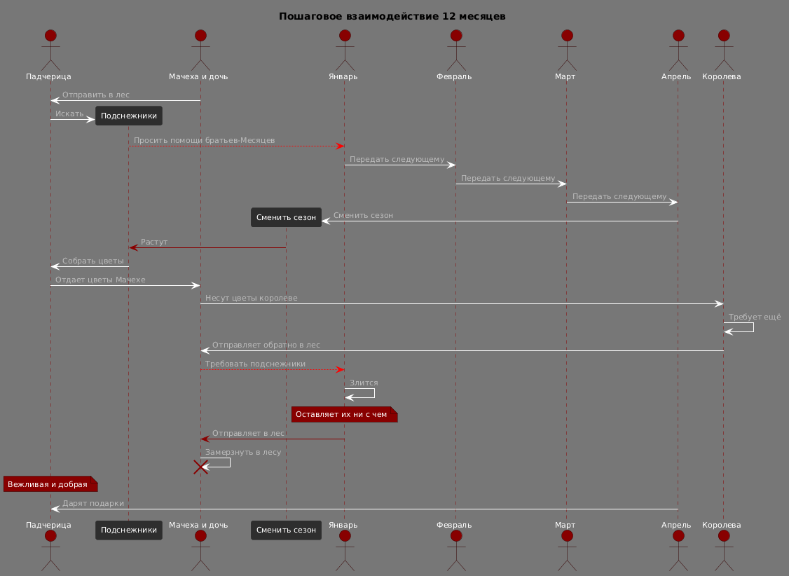

# Sequence Diagram: Пошаговое взаимодействие в системе "12 месяцев"

## Обзор

Эта диаграмма последовательности показывает пошаговое взаимодействие между актёрами и объектами в системе "12 месяцев".

## Актеры и участники

| Актер/Участник | Обозначение | Описание |
|----------------|-------------|----------|
| Падчерица | P | Добрая девушка, которую отправляют в лес |
| Подснежники | EB | Цветы, которые нужно найти |
| Мачеха и дочь | M | Жадные персонажи |
| Сменить сезон | EA | Действие по смене времени года |
| Январь | J | Первый месяц в цепочке |
| Февраль | F | Второй месяц |
| Март | D | Третий месяц |
| Апрель | A | Четвёртый месяц, дарующий цветы |
| Королева | K | Капризная правительница |

## Шаги взаимодействия

### Шаг 1: Отправка в лес
- Мачеха и дочь отправляют Падчерицу в лес

### Шаг 2: Поиск и просьба о помощи
- Падчерица ищет подснежники
- Падчерица просит помощи у Января

### Шаг 3: Цепочка передачи жезла
- Январь передаёт жезл Февралю
- Февраль передаёт Марту
- Март передаёт Апрелю

### Шаг 4: Смена сезона и рост цветов
- Апрель меняет сезон (Spring_Temporary)
- Вырастают подснежники
- Падчерица собирает цветы

### Шаг 5: Передача цветов Королеве
- Падчерица отдаёт цветы Мачехе
- Мачеха везёт цветы Королеве

### Шаг 6: Наказание
- Королева требует ещё цветов
- Королева отправляет Мачеху и дочь обратно в лес
- Мачеха и дочь требуют подснежники у Января
- Январь злится и оставляет их ни с чем
- Мачеха и дочь замерзают в лесу

### Шаг 7: Награда
- Падчерица ведёт себя вежливо и добро
- Месяцы дарят Падчерице подарки

## Ключевые наблюдения

1. **Цепочка передачи** строго последовательна: J → F → D → A
2. **Только после Апреля** меняется сезон и растут цветы
3. **Грубость** Мачехи и дочери приводит к замерзанию
4. **Доброта** Падчерицы приводит к награде

## Диаграмма



```plantuml
@startuml
!theme reddress-darkred

title "Пошаговое взаимодействие 12 месяцев"
actor "Падчерица" as P
participant "Подснежники" as EB
actor "Мачеха и дочь" as M
participant "Сменить сезон" as EA
actor "Январь" as J
actor "Февраль" as F
actor "Март" as D
actor "Апрель" as A
actor "Королева" as K

M -> P : Отправить в лес
P -> EB **: Искать
EB --[#red]> J : Просить помощи братьев-Месяцев
J -> F : Передать следующему
F -> D : Передать следующему
D -> A : Передать следующему
A -> EA **: Сменить сезон
EA -[#darkred]> EB : Растут
EB -> P : Собрать цветы
P -> M : Отдает цветы Мачехе
M -> K : Несут цветы королеве
K -> K : Требует ещё
K -> M : Отправляет обратно в лес
M --[#red]> J : Требовать подснежники
J -> J : Злится
note over J : Оставляет их ни с чем
J -[#darkred]> M : Отправляет в лес
M -> M : Замерзнуть в лесу
destroy M
note over P : Вежливая и добрая
A -> P : Дарят подарки

@enduml
