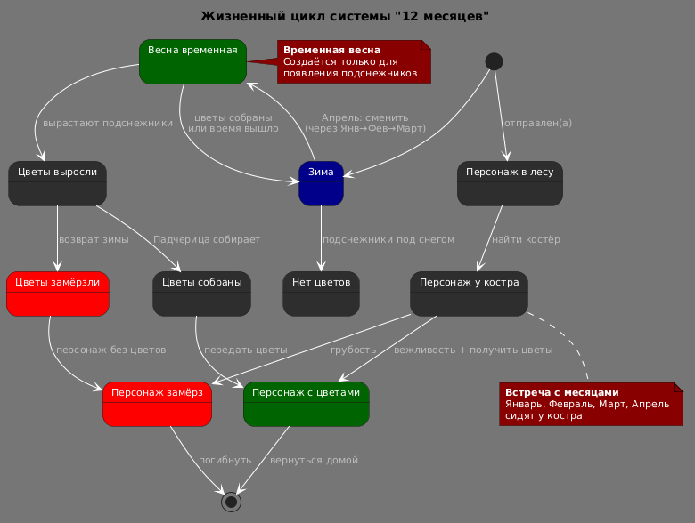

# State Diagram: Жизненный цикл системы "12 месяцев"

## Обзор

Эта диаграмма состояний показывает полный жизненный цикл системы "12 месяцев", включая смену сезонов, состояние цветов и состояние персонажей.

## Состояния

### Сезоны

| Состояние | Описание | Цвет фона |
|-----------|----------|-----------|
| Зима | Холодное время года, цветы не растут | Dark Blue |
| Весна временная | Временная весна, создаваемая Апрелем | Dark Green |

### Состояния цветов

| Состояние | Описание | Цвет фона |
|-----------|----------|-----------|
| Нет цветов | Подснежники под снегом | Default |
| Цветы выросли | Подснежники распустились | Default |
| Цветы собраны | Падчерица собрала цветы | Default |
| Цветы замёрзли | Цветы погибли от мороза | Red |

### Состояния персонажей

| Состояние | Описание | Цвет фона |
|-----------|----------|-----------|
| Персонаж в лесу | Отправлен(а) за цветами | Default |
| Персонаж у костра | Встретил(а) братьев-месяцев | Default |
| Персонаж замёрз | Погиб(ла) от холода | Red |
| Персонаж с цветами | Успешно собрал(а) цветы | Dark Green |

## Переходы состояний

### Сезоны
- [*] → Зима : Начало
- Зима → Весна : Апрель: сменить (через Янв→Фев→Март)
- Весна → Зима : цветы собраны или время вышло

### Цветы
- Зима → Нет цветов : подснежники под снегом
- Весна → Цветы выросли : вырастают подснежники
- Цветы выросли → Цветы собраны : Падчерица собирает
- Цветы выросли → Цветы замёрзли : возврат зимы

### Персонажи
- [*] → Персонаж в лесу : отправлен(а)
- Персонаж в лесу → Персонаж у костра : найти костёр
- Персонаж у костра → Персонаж замёрз : грубость
- Персонаж у костра → Персонаж с цветами : вежливость + получить цветы
- Персонаж с цветами → [*] : вернуться домой
- Персонаж замёрз → [*] : погибнуть

### Синхронизация
- Цветы собраны → Персонаж с цветами : передать цветы
- Цветы замёрзли → Персонаж замёрз : персонаж без цветов

## Ключевые моменты

- **Точка выбора**: Проверяет поведение персонажа (вежливость/грубость)
- **Временная весна**: Создаётся только для появления подснежников
- **Встреча с месяцами**: Январь, Февраль, Март, Апрель сидят у костра

## Диаграмма



```plantuml
@startuml
!theme reddress-darkred

skinparam state {
  BackgroundColor<<Winter>> #darkblue
  BackgroundColor<<Spring_Temporary>> #darkgreen
  BackgroundColor<<Broken>> #red
  BackgroundColor<<Success>> #darkgreen
}

title Жизненный цикл системы "12 месяцев"

state "Зима" as Зима <<Winter>>
state "Весна временная" as Весна <<Spring_Temporary>>

state "Нет цветов" as НетЦветов
state "Цветы выросли" as ЦветыЕсть
state "Цветы собраны" as ЦветыСобраны
state "Цветы замёрзли" as ЦветыЗамёрзли <<Broken>>

state "Персонаж в лесу" as ВЛесу
state "Персонаж у костра" as УКостра
state "Персонаж замёрз" as Замёрз <<Broken>>
state "Персонаж с цветами" as СЦветами <<Success>>

[*] --> Зима

Зима --> Весна : Апрель: сменить\n(через Янв→Фев→Март)
Весна --> Зима : цветы собраны\nили время вышло

Зима --> НетЦветов : подснежники под снегом
Весна --> ЦветыЕсть : вырастают подснежники

ЦветыЕсть --> ЦветыСобраны : Падчерица собирает
ЦветыЕсть --> ЦветыЗамёрзли : возврат зимы

[*] --> ВЛесу : отправлен(а)
ВЛесу --> УКостра : найти костёр
УКостра --> Замёрз : грубость
УКостра --> СЦветами : вежливость + получить цветы
СЦветами --> [*] : вернуться домой
Замёрз --> [*] : погибнуть

ЦветыСобраны --> СЦветами : передать цветы
ЦветыЗамёрзли --> Замёрз : персонаж без цветов

note right of Весна
  **Временная весна**
  Создаётся только для
  появления подснежников
end note

note bottom of УКостра
  **Встреча с месяцами**
  Январь, Февраль, Март, Апрель
  сидят у костра
end note

@enduml
